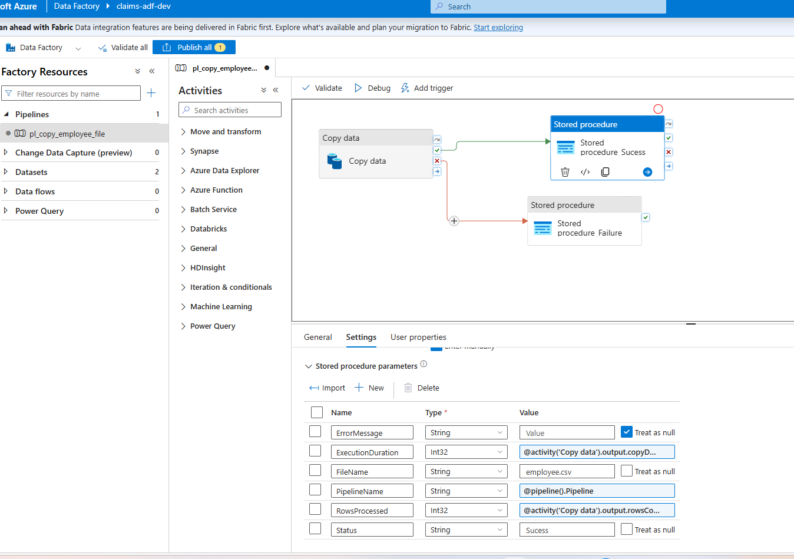
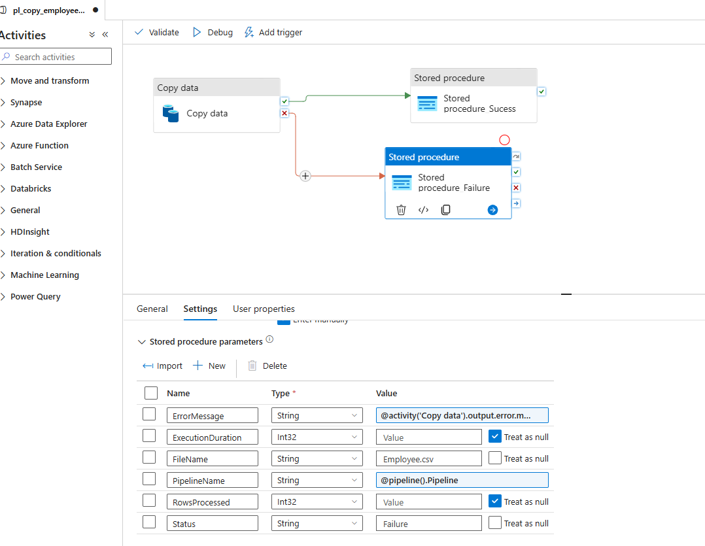
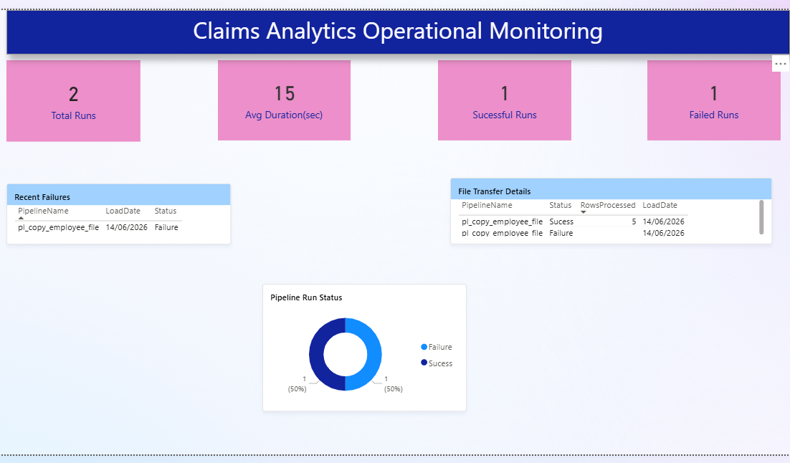

# azure-data-ops-monitoring

End-to-end Azure Data Factory monitoring solution built using Azure SQL Database, Stored Procedures, and Power BI.

This project demonstrates how to implement operational monitoring, audit logging, and failure tracking for Azure data pipelines. Pipeline execution details are captured in an audit table and visualized through an interactive Power BI dashboard.

## Project Objectives

- Monitor Azure Data Factory pipeline executions
- Capture audit and operational metrics
- Track file processing status and execution outcomes
- Store audit information in Azure SQL Database
- Visualize operational KPIs using Power BI

## Solution Architecture

```text
Employee CSV
↓
Azure Blob Storage
↓
Azure Data Factory
↓
Azure SQL Database
↓
Audit & Monitoring Tables
↓
Power BI Monitoring Dashboard
```
## Technologies Used

- Azure Data Factory
- Azure SQL Database
- Azure Blob Storage
- Power BI
- SQL
- SQL Stored Procedures
- Git & GitHub
## Key Features

- Success and failure pipeline tracking
- Dynamic audit logging using stored procedures
- Rows processed monitoring
- Execution duration tracking
- Error message capture and storage
- Power BI operational dashboard
  
## Audit Metrics Captured

- Pipeline Name
- File Name
- Load Date
- Status (Success / Failure)
- Rows Processed
- Execution Duration
- Error Message

## Stored Procedure
Audit logging is implemented using:

- `sql/usp_insertAuditing.sql`

The stored procedure records pipeline execution details into the Audit_Log table for operational monitoring and troubleshooting.
## Power BI Dashboard

The monitoring dashboard provides:

- Total Pipeline Runs
- Successful Runs
- Failed Runs
- Average Execution Duration
- Recent Failure Tracking
- Pipeline Execution History
- Success vs Failure Analysis

## Screenshots

### Success Logging Pipeline



### Failure Logging Pipeline



### Monitoring Dashboard



